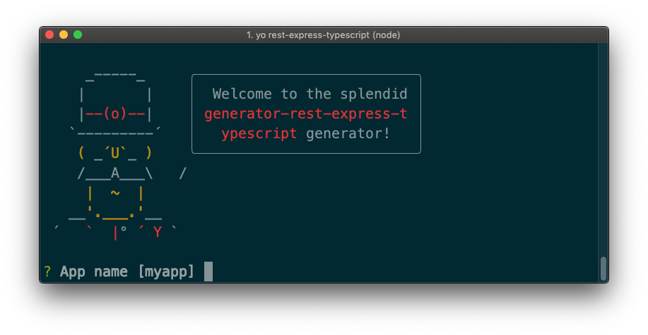

# generator-rest-express-typescript [![NPM version][npm-image]][npm-url] [![Build Status][travis-image]][travis-url] [![Coverage percentage][coveralls-image]][coveralls-url]
> Create a REST API in typescript with [Express](https://expressjs.com/fr/) and [Typeorm](https://typeorm.io/#/)




## Installation

First, install [Yeoman](http://yeoman.io) and generator-rest-express-typescript using [npm](https://www.npmjs.com/) (we assume you have pre-installed [node.js](https://nodejs.org/)).

```bash
npm install -g yo
npm install -g generator-rest-express-typescript
```

Then generate your new project:

```bash
yo rest-express-typescript myapp
```
## Very coolos features

* generate openapi documention with a simple command, and read it via swagger-ui
* Logs with morgan

## Getting Started

* Run `npm start` to preview and watch for changes
* Run `npm run migration:run` to run migration scripts
* Run `npm run debug` to lauchn debug mode
* Run `npm run build` to create the production version
* Run `npm run test` to lauch jest test
* Run `npm run swagger:generate`to generate the swagger file from code
## Docker

You can use docker during your developement process.
First, build the docker image:
```bash
docker build -t myapp .
```

And run it:
```bash
docker run -p 3000:3000 -v $(pwd):/usr/src/app myapp
```
## TODO 🚧  

* Add subcommand to create a new endpoint

## Contribute

See the [contributing docs](contributing.md).

## License

MIT © [Clément Lafont](johnrazeur@gmail.com)


[npm-image]: https://badge.fury.io/js/generator-rest-express-typescript.svg
[npm-url]: https://npmjs.org/package/generator-rest-express-typescript
[travis-image]: https://travis-ci.org/johnrazeur/generator-rest-express-typescript.svg?branch=master
[travis-url]: https://travis-ci.org/johnrazeur/generator-rest-express-typescript
[coveralls-image]: https://coveralls.io/repos/johnrazeur/generator-rest-express-typescript/badge.svg
[coveralls-url]: https://coveralls.io/r/johnrazeur/generator-rest-express-typescript
